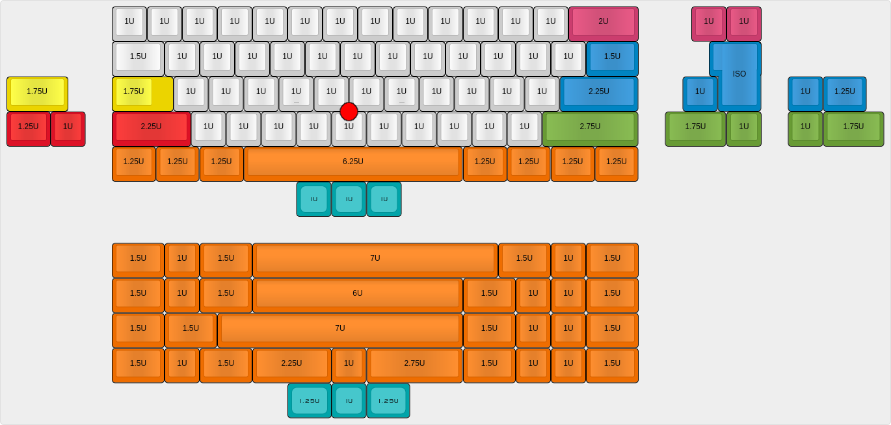
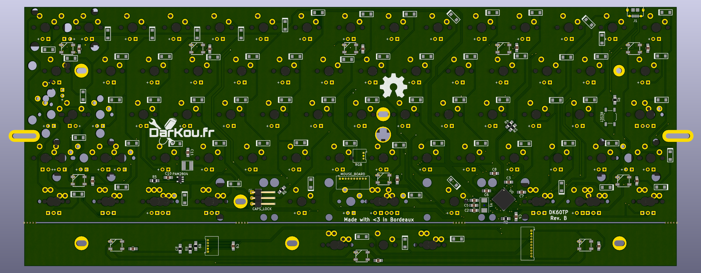
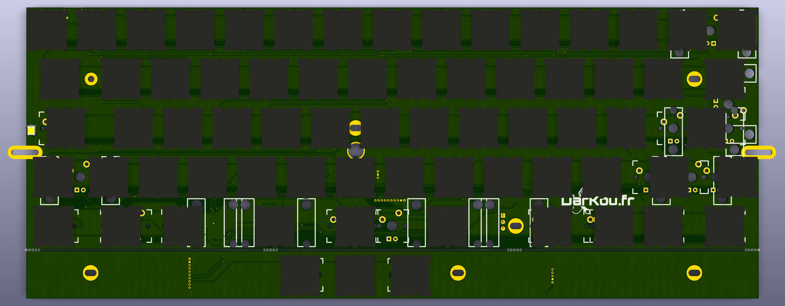

# DK60TP
Mechanical keyboard with backlit, rgb underglow and Trackpoint support.

:warning: Still in development :warning:

## Features
- Poker case compatible (if you don't use Trackpoint)
- IBM Trackpoint
- Many layouts
- Backlit
- RGB underglow
- Open Hardware

## Supported layouts

## PCB render

## Customisation

DK60TP allows some customisations like RGB underglow and caps lock led.

### Capslock led

Capslock led can be tuned to :
* enable internal led
* disabled it
* use external led

To do this you need to play with the 3 pins connector placed near the reset button.

#### Pinout
* 1: +Vled (square pin)
* 2: Integrated led
* 3: GND

#### Example

##### Integrated led
Place a jumper between pin 1 and 2.

##### External led
Connect your led and resistor between pin 1 and 3.

##### Disable led
Remove the jumper or place it between pin 2 and 3.

### RGB underglow

To add more leds (use WS2812B with capacitor) simply use `RGB` connector on the mainboard.

:warning: Do not connect `RGB` connector if you use the second PCB (those with mouse buttons).

#### Pinout
* 1: Vcc (square pin)
* 2: GND
* 3: Din

## Firmware

DK60TP still in development and for now does not have associate firmware, but it will be supported by QMK firmware.

## Used softwares
I've only used Open Source software to make all parts of this project.

List of used softwares:
* OS: Debian
* Kicad
* QCad
* Freecad
* ...

## Third party
Libraries and footprints are provided by Hasu, /u/techieee, mohitg11 and me.

## External links

* [PCB guide](https://github.com/ruiqimao/keyboard-pcb-guide)
* [Hasu's lib](https://github.com/tmk/kicad_lib_tmk)
* [Hasu's footprint](https://github.com/tmk/keyboard_parts.pretty)
* [/u/techieee's footprint](https://github.com/egladman/keebs.pretty)
* [mohitg11's footprints and libraries](https://github.com/mohitg11/TS65AVR)
* [Plate generator](http://builder.swillkb.com/)
* [QMK Firmware](https://github.com/qmk/qmk_firmware)
